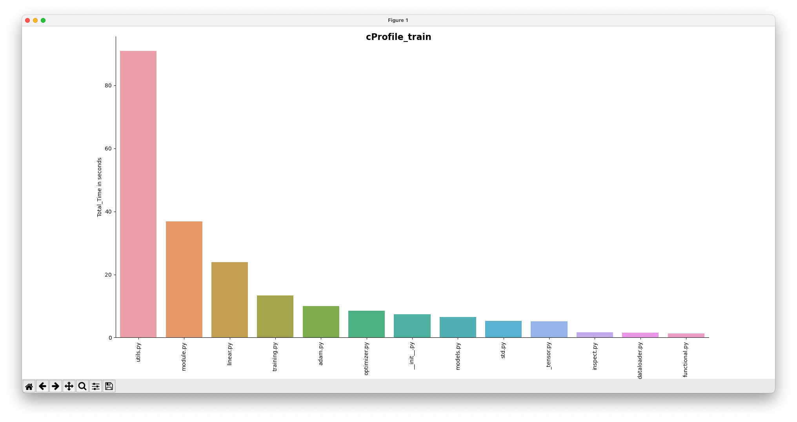
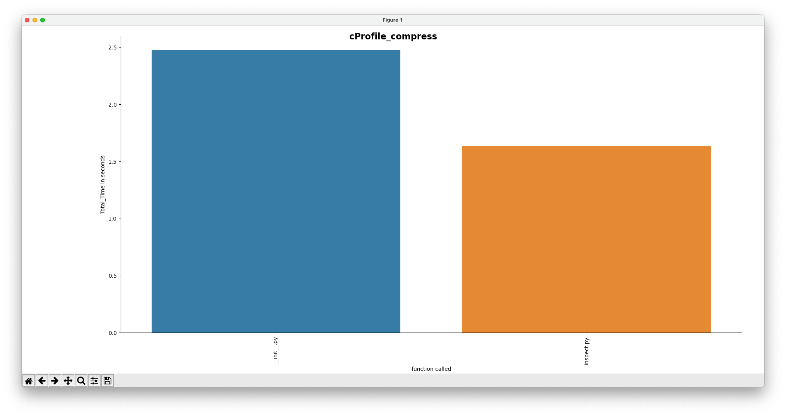
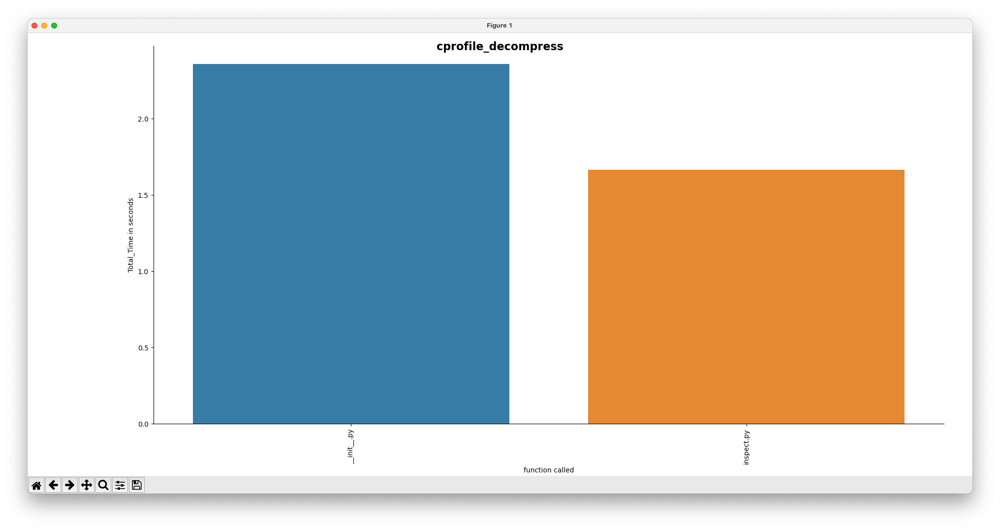

# Google Summer of Code 2023 - CERN 

## Contributor - Manas Pratim Biswas

### Estimating the Energy Cost of a Scientific Software


- Repository Structure

```
.
├── GSoCEvaluationTask
├── README.md
├── Scaphandre
├── baler
└── cProfile

baler
├── Dockerfile
├── Dockerfile.arm64
├── Dockerfile.gpu
├── LICENSE
├── NOTICE
├── README.md
├── baler
├── bin
├── docs
├── entrypoint.sh
├── fixuid.sh
├── poetry.lock
├── profiling
├── pyproject.toml
├── requirements.txt
├── tests
└── workspaces

baler/profiling
└── cProfile
    ├── cprofile_compress.csv
    ├── cprofile_compress.prof
    ├── cprofile_compress.py
    ├── cprofile_compress.txt
    ├── cprofile_decompress.csv
    ├── cprofile_decompress.prof
    ├── cprofile_decompress.py
    ├── cprofile_decompress.txt
    ├── cprofile_train.csv
    ├── cprofile_train.prof
    ├── cprofile_train.py
    └── cprofile_train.txt
```

#### Profiling Baler with cProfile

- Training
```console
    poetry run python -m cProfile -o profiling/cProfile/cprofile_train.txt -m baler --mode train --project CFD_workspace CFD_project_animation
    poetry run python -m cProfile -o profiling/cProfile/cprofile_train.prof -m baler --mode train --project CFD_workspace CFD_project_animation
```

- Compressing
```console
    poetry run python -m cProfile -o profiling/cProfile/cprofile_compress.txt -m baler --mode compress --project CFD_workspace CFD_project_animation
    poetry run python -m cProfile -o profiling/cProfile/cprofile_compress.prof -m baler --mode compress --project CFD_workspace CFD_project_animation
```

- Decompressing
```console
    poetry run python -m cProfile -o profiling/cProfile/cprofile_decompress.txt -m baler --mode decompress --project CFD_workspace CFD_project_animation
    poetry run python -m cProfile -o profiling/cProfile/cprofile_decompress.prof -m baler --mode decompress --project CFD_workspace CFD_project_animation
```

- Results

---


---


---
