# Google Summer of Code 2023

<br />


<br />

## Contributor : _Manas Pratim Biswas_

## Description

- **Year**: 2023
- **Organisation**: [CERN-HSF](https://hepsoftwarefoundation.org) 
- **Project Title**: [Estimating the Energy Cost of Scientific Software](https://summerofcode.withgoogle.com/programs/2023/projects/Nks9akq7)
- **Project Proposal**: [Estimating the Energy Cost of Scientific Software](https://drive.google.com/file/d/1z_1FtA_3vyRjwqYh57Z3KfXUJU8wsPAT/view?usp=sharing)
- **Repository**: [baler-collaboration/baler](https://github.com/baler-collaboration/baler)
- **Mentor**: [Caterina Doglioni](https://www.hep.lu.se/staff/doglioni/) ([@urania277](https://github.com/urania277)) _&_ [Benedikt Hegner](https://www.linkedin.com/in/benedikt-hegner-7451832) ([@hegner](https://github.com/hegner))
- **Project Size**: Large

<br/>

## Project Details

Estimate the _energy efficiency_ and _performance_ of a scientific software - _Baler_ and attempt to identify where this efficiency can be improved. 

> **Background**: The _Large Hadron Collider (LHC) experiments_  generate massive datasets composed of billions of _proton-proton_ collisions. The analysis of this data requires _high-throughput scientific computing_ that relies on efficient software algorithms. In today’s world, where **energy crisis** and **environmental issues** are becoming more pressing concerns, it is crucial that we start taking action to develop sustainable software solutions. As scientific software is being used more and more in high-throughput computing, there is a growing need to optimize its _energy efficiency_ and reduce its _carbon footprint_.

<br/>

## Project Report

> _The Baler project is a collaboration between 12 research physicists, computer scientists, and machine learning experts at the universities of Lund, Manchester, and Uppsala. Baler, is a tool that uses machine learning to derive a compression that is tailored to the user’s input data, achieving large data reduction and high fidelity where it matters. [Read more about Baler](https://baler-collaboration.github.io)_

Throughout the summer, I have spent most of my time exploring **_profilers_** and learning about profiling small code snippets and softwares in general.

Initially, I profiled _Baler_ with multiple profilers with varied techniques. Some profilers like _codecarbon_ had to be used as _**wrappers**_ or invoked as _**APIs**_ while others like _cProfile_, _pyinstruments_, _powermetrics_ had to be used as **standalone commands** with optional `-flags` directly from the terminal.

### 💡 Visualizing cProfile logs

#### How to profile Baler using cProfile ?

Baler can be profiled with cProfile by adding the flag `--cProfile` while training

Example:

```bash
poetry run baler --project CFD_workspace CFD_project_animation --mode train --cProfile
```

The profile logs will be stored at:
`workspaces/CFD_workspace/CFD_project_animation/output/profiling/`

Note: A Keyboard Interrupt is necessary to stop and exit from the _SnakeViz_ server

_cProfile profiles visualized using SnakeViz_
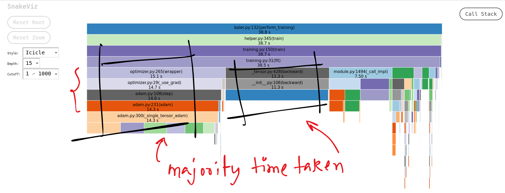

_call stack generated by SnakeViz from cProfile profiles_
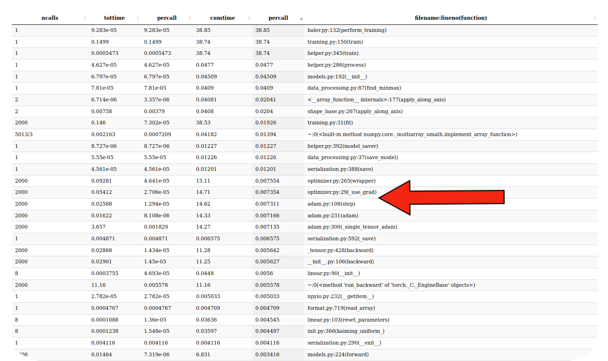

🕓 The majority time is taken by the `optimizer` for performing the gradient descent

#### Directed Graphs (Di Graphs):

- A directed graph (digraph) is a graph that is made up of vertices (nodes) connected by directed edges.
- In the context of profiling, a directed graph can represent the flow of program execution. Nodes may correspond to functions or code blocks, and edges indicate the direction of execution from one node to another.

#### Call Graphs:

- A call graph is a type of directed graph that represents the relationships between functions in a program.
- In the context of profiling, a call graph visualizes how functions call each other during program execution. Each node in the graph typically corresponds to a function, and directed edges show the flow of control from one function to another.

#### Usage:

- Di graphs and call graphs are powerful tools for profiling and optimization, offering insights into the structure and behavior of the code.
- Visualization aids in comprehending complex relationships between functions, making it easier to comprehend the call order and time taken by the various parts of the function calls.

_This is the call graph generated, rooted at the `perform_training()` function when baler is trained for 2000 epochs on the CFD Dataset_

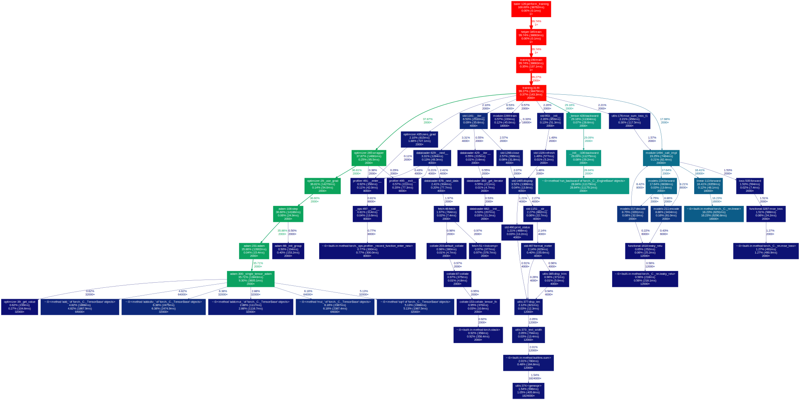

🕓 The majority time is taken by the `optimizer` for performing the gradient descent <br />
🕓 The _Back Propagation_ takes more time than _Forward Propagation_

Hence, the results are in compliance with each other

### 💡 Powermetrics with InfluxDB

Powermetrics is a built-in tool for macOS which monitors CPU usage and determines how much CPU time and CPU power is being allocated to different quality of service classes (QoS). <br />

InfluxDB is a time-series database that can be used to visualize the real-time logs generated by _Powermetrics_

1. Install InfluxDB

```bash
brew install influxdb
```

In case you don't have `homebrew`, get [homebrew from here](https://brew.sh)

2. Starting the InfluxDB service

```bash
brew services start influxdb
```

InfluxDB runs on port `8086` by default. Assuming that you have not made any changes to its default configuration, you can see if everything is properly installed and running by accessing it on `localhost` at port `8086`

```bash
http://127.0.0.1:8086 or http://localhost:8086
```

If InfluxDB welcome page loads up, then everything is setup properly. The official documentation to setup the credentials and bucket can be found in the [official documentation](https://docs.influxdata.com/influxdb/v2/install)

3. Scripting to save the _powermetrics_ log into _InfluxDB_

This script should be executed before running _Baler_. The script runs continuously in the background while _baler_ runs in one of the modes in a separate terminal.

```py
from datetime import datetime
import signal
import sys
import subprocess

from influxdb_client import InfluxDBClient, Point, WritePrecision
from influxdb_client.client.write_api import SYNCHRONOUS

def powermetrics_profile():

    token = "<Your API Token>"
    org = "<Your Organization Name"
    bucket = "<Your Bucket Name>"

    client = InfluxDBClient(url="http://localhost:8086", token=token, org=org)
    write_api = client.write_api(write_options=SYNCHRONOUS)

    process = subprocess.Popen("/usr/bin/powermetrics -i 300 --samplers cpu_power -a --hide-cpu-duty-cycle", shell=True, stdout=subprocess.PIPE, bufsize=3)
    while True:
        out = process.stdout.readline().decode()
        if out == '' and process.poll() != None:
            break
        if out != '':
            if ' Power: ' in out:
                metrics = out.split(' Power: ')
                point = Point(metrics[0]) \
                    .tag("host", "host1") \
                    .field("power", int(metrics[1].replace('mW', ''))) \
                    .time(datetime.utcnow(), WritePrecision.NS)

                write_api.write(bucket, org, point)
                sys.stdout.flush()


    with subprocess.Popen("/usr/bin/powermetrics -i 300 --samplers cpu_power -a --hide-cpu-duty-cycle | grep -B 2 'GPU Power'", shell=True, stdout=subprocess.PIPE, bufsize=3) as p:
        for c in iter(lambda: p.stdout.readline(), b''):
            sys.stdout.write(c)
        for line in p.stdout.read():
            metrics = line.split(' Power: ')
            print(line)

powermetrics_profile()
```

`sudo` access is needed to run the script. Suppose you have saved the script with the file name `influxdb.py` then run the script as below, depending on your environment.

```bash
sudo python3 influxdb.py
```

or

```bash
sudo poetry run influxdb.py
```

4. InfluxDB dashboard setup

- Open bucket on the InfluxDB UI
- Create a new empty dashboard in the bucket
- Add three widgets for CPU Power and GPU Power respectively
- Now that we have three gauges added, we need to define the data to be used by the gauges.
- Values that are stored in the time series database are stored in mW. It more intuitive to use Watts which makes it easier to compare the data with other machines online.
- Edit each gauge by clicking on the Settings(Cog) button and clicking Configure. This will open the Query window. Query is used to pull data from the time series database.

5. Query to view the power consumption in real-time

Note: Here the bucket is named `baler`

- CPU Power Consumption

```bash
from(bucket: "baler")
  |> range(start: v.timeRangeStart, stop: v.timeRangeStop)
  |> filter(fn: (r) => r["_measurement"] == "CPU")
  |> map(fn: (r) => ({ r with _value: float(v:r._value)/1000.00}))
  |> aggregateWindow(every: v.windowPeriod, fn: mean, createEmpty: false)
  |> yield(name: "last")
```

- GPU Power Consumption

```bash
from(bucket: "baler")
  |> range(start: v.timeRangeStart, stop: v.timeRangeStop)
  |> filter(fn: (r) => r["_measurement"] == "GPU")
  |> map(fn: (r) => ({ r with _value: float(v:r._value)/1000.00}))
  |> aggregateWindow(every: v.windowPeriod, fn: mean, createEmpty: false)
  |> yield(name: "last")
```

Save the queries in the respective gauges and reload the page. The gauges should update values in realtime. The auto-refresh option can be set to indefinite and 10s.

6. Sample Outputs from _InfluxDB_ dashboard. All the reading are in $Watt$

_Baler training starts_
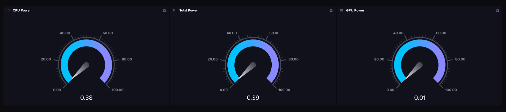

_Baler training ongoing_
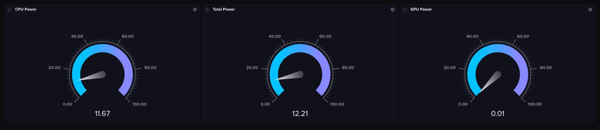

_Baler training ends_
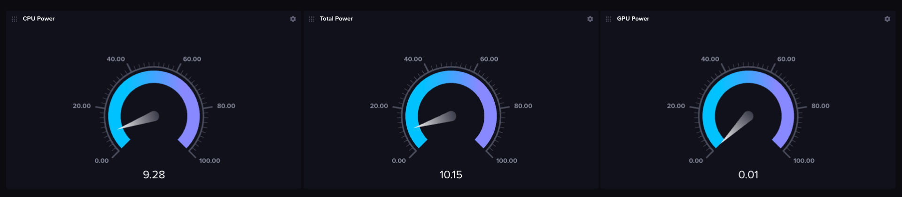

Note: A Keyboard Interrupt is necessary to stop and exit from the `influxdb.py` script.

### 💡 Visualizing codecarbon logs

#### How to profile Baler using codecarbon ?

Baler can be profiled with codecarbon by adding the flag `--energyProfile` while training

Example:

```bash
poetry run baler --project CFD_workspace CFD_project_animation --mode train --energyProfile
```

The profile logs will be stored at:
`workspaces/CFD_workspace/CFD_project_animation/output/profiling/`

_Conventions and Units used by codecarbon_
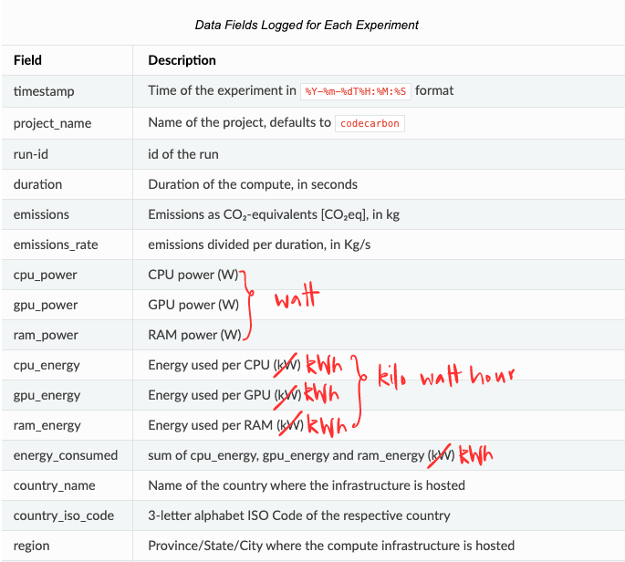

#### Setup to estimate energy using _codecarbon_

- Training was done on the **_CFD Dataset_** with my **_Apple MacBook Air_** having the following specifications

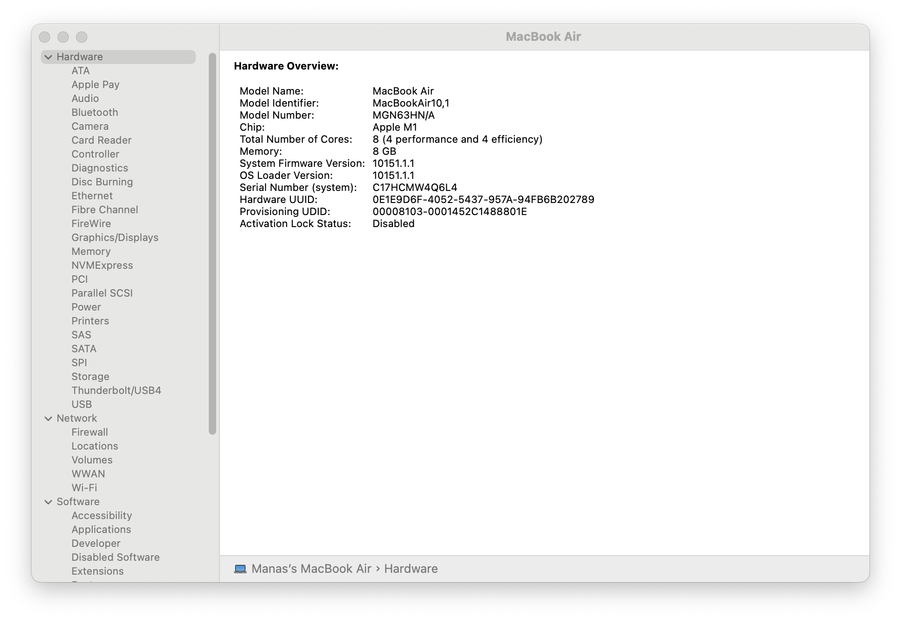

- A scaling factor of `1e6` or $10^6$ was used to generate the plots for 50 baler runs each with 1000 epochs with the following configuration:

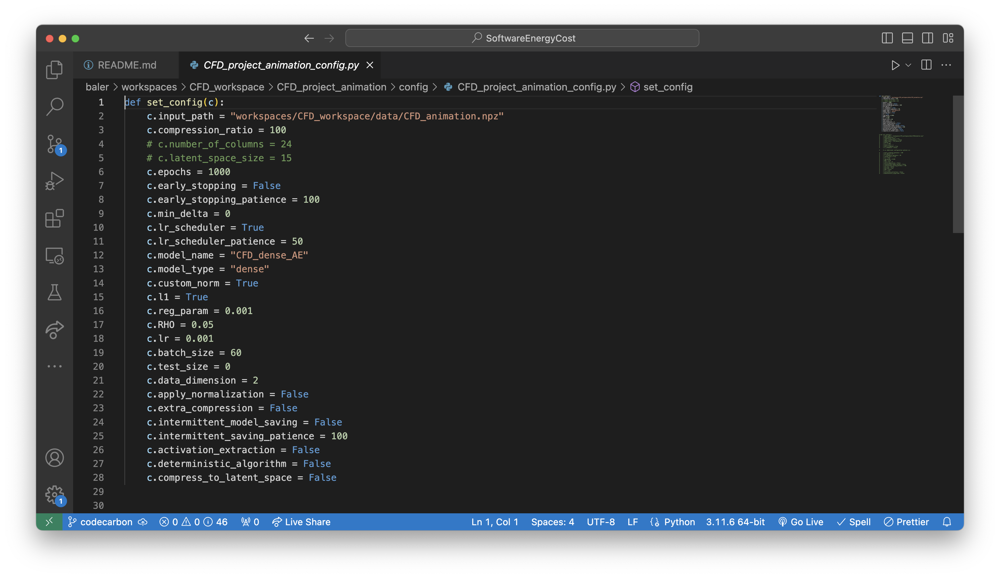

_Plots for Train_
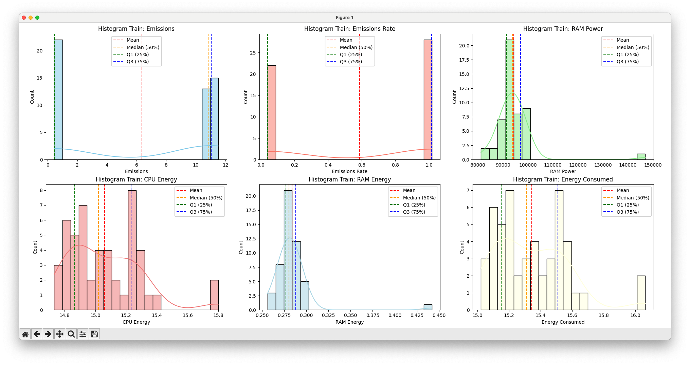

_Plots for Compression_
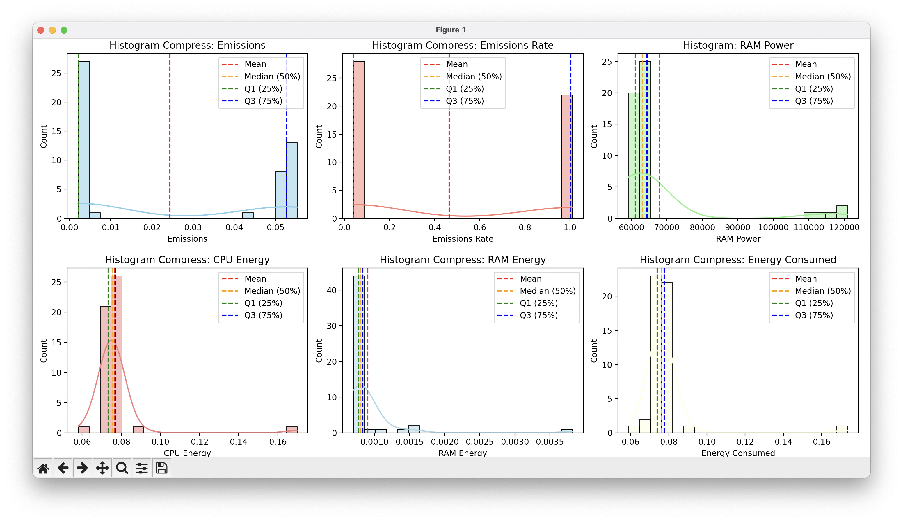

_Plots for Decompression_
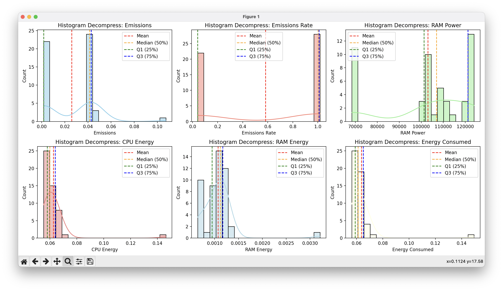

#### Summarizing the results

| $Mode$     | $CO_{2} Emission$ ($CO_{2}$ $Eqv\ in\ Kg$) | $Energy\ Consumed$ ($kWh$) |
| ---------- | ------------------------------------------ | -------------------------- |
| Train      | $6.25$                                     | $15.35$                    |
| Compress   | $0.024$                                    | $0.075$                    |
| Decompress | $0.022$                                    | $0.063$                    |

Note - Scaling factor was introduced simply because the numbers generated were small in magnitude and were difficult to plot. Hence, each values were scaled up by a factor of $10^6$. So, apart from the time axis, if a particular value on any axis is read as $V_{plot}$ from the plot, the value should be scaled down as : $$V_{actual} = V_{plot} * 10^{-6}$$

### 🔍 List of all Tools used

| No. | Profiler/Tool                                                                                                                                    | Description                                                                                                                                                                                                                                                                                                                                                                                                                                                                                                                                                                                                                                                                                                                                      |
| --- | ------------------------------------------------------------------------------------------------------------------------------------------------ | ------------------------------------------------------------------------------------------------------------------------------------------------------------------------------------------------------------------------------------------------------------------------------------------------------------------------------------------------------------------------------------------------------------------------------------------------------------------------------------------------------------------------------------------------------------------------------------------------------------------------------------------------------------------------------------------------------------------------------------------------ |
| 1   | [cProfile](https://docs.python.org/3/library/profile.html)                                                                                       | _cProfile_ provides [_Deterministic Profiling_](https://sceweb.sce.uhcl.edu/helm/WEBPAGE-Python/documentation/python_tutorial/lib/Deterministic_Profiling.html) of Python programs. A profile is a set of statistics that describes how often and for how long various parts of the program executed. Is measures the [_CPU_](https://pythonspeed.com/articles/blocking-cpu-or-io) time                                                                                                                                                                                                                                                                                                                                                          |
| 2   | [pyinstruments](https://github.com/joerick/pyinstrument)                                                                                         | _pyinstruments_ provides [_Statistical Profiling_](<https://en.wikipedia.org/wiki/Profiling_(computer_programming)>) of Python programs. It doesn’t track every function call that the program makes. Instead, it records the call stack every 1ms and measures the [_Wall Clock_](https://stackoverflow.com/questions/7335920/what-specifically-are-wall-clock-time-user-cpu-time-and-system-cpu-time-in-uni) time                                                                                                                                                                                                                                                                                                                              |
| 3   | [experiment-impact-tracker](https://github.com/Breakend/experiment-impact-tracker)                                                               | _experiment-impact-tracker_ tracks energy usage, carbon emissions, and compute utilization of the system. Currently, on Linux systems with Intel chips (that support the _RAPL_ or _powergadget_ interfaces) and _NVIDIA GPUs_. It records power draw from CPU and GPU, hardware information, python package versions and estimated carbon emissions information                                                                                                                                                                                                                                                                                                                                                                                 |
| 4   | [scalene](https://github.com/plasma-umass/scalene)                                                                                               | _Scalene_ is a high-performance CPU, GPU and memory profiler for Python that incorporates AI-powered proposed optimizations                                                                                                                                                                                                                                                                                                                                                                                                                                                                                                                                                                                                                      |
| 5   | [memory-profiler](https://pypi.org/project/memory-profiler)                                                                                      | _memory-profiler_ is a python module for monitoring memory consumption of a process as well as line-by-line analysis of memory consumption for python programs                                                                                                                                                                                                                                                                                                                                                                                                                                                                                                                                                                                   |
| 6   | [memray](https://github.com/bloomberg/memray)                                                                                                    | _Memray_ is a memory profiler for Python. It can track memory allocations in Python code, in native extension modules, and in the Python interpreter itself. It can generate several different types of reports to analyze the captured memory usage data.                                                                                                                                                                                                                                                                                                                                                                                                                                                                                       |
| 7   | [codecarbon](https://github.com/mlco2/codecarbon)                                                                                                | _codecarbon_ is a Python package that estimates the hardware electricity power consumption (GPU + CPU + RAM) and apply to it the carbon intensity of the region where the computing is done. The [_methodology_](https://mlco2.github.io/codecarbon/methodology.html) behind the package involves the use a scheduler that, by default, call for the measure every 15 seconds and measures the CO₂ as per the formula Carbon dioxide emissions $(CO₂eq) = C * E$ <br/> <br /> Here, `C` = Carbon Intensity of the electricity consumed for computation: quantified as g of CO₂ emitted per kilowatt-hour of electricity and `E` = Energy Consumed by the computational infrastructure: quantified as kilowatt-hours.                             |
| 8   | [Eco2AI](https://github.com/sb-ai-lab/Eco2AI)                                                                                                    | _Eco2AI_ is a Python library for CO₂ emission tracking. It monitors energy consumption of CPU & GPU devices and estimates equivalent carbon emissions taking into account the regional emission coefficient.                                                                                                                                                                                                                                                                                                                                                                                                                                                                                                                                     |
| 9   | [powermetrics](https://www.unix.com/man-page/osx/1/powermetrics) _with_ [InfluxDB](https://abhimanbhau.github.io/mac/m1-mac-power-usage-monitor) | _powermetrics_ gathers and displays CPU usage statistics (divided into time spent in user mode and supervisor mode), timer and interrupt wake-up frequency (total and, for near-idle workloads, those that resulted in package idle exits), and on supported platforms,interrupt frequencies (categorized by CPU number), package C-state statistics (an indication of the time the core complex + integrated graphics, if any, were in low-power idle states), as well as the average execution frequency for each CPU when not idle. This comes with as a default with _UNIX_ and therefore can be considered a standard. <br /><br /> _influxDB_ is a time-series database that can be used to visualize the logs generated by _powermetrics_ |

## Contributions 

I have incorporated some of the profilers into the `baler` codebase and made multiple commits spread across the subsequent Pull Requests at [baler-collaboration/baler](https://github.com/baler-collaboration/baler) and are listed in the reverse chronological order

- [ ] Integrate _scalene_, _eco2ai_ and _memray_ to profile baler on the basis of a conditional flag ($_{WIP}$)

<br/>

- [x] Visualize cProfile logs and dumps ([**PR #331**](https://github.com/baler-collaboration/baler/pull/331)) 🟨

  - Implemented SnakeViz visualizations from cProfile `prof` through wrappers and subprocess
  - Implemented Di-graph generation using yelp-gprof2dot.
  - Utilized graphviz to parse the `dot` files and render into various formats like `.SVG`, `.PNG`, `.PDF`

<br/>

- [x] Implement codecarbon plots ([**PR #330**](https://github.com/baler-collaboration/baler/pull/330)) 🟨

  - Dumped the codecarbon logs into a `.CSV` file
  - Subsequently parsed the `.CSV` file to generate plots

<br/>

- [x] Added -m flag while training baler. Fixes Import Error ([**PR #286**](https://github.com/baler-collaboration/baler/pull/286)) 🟥

  - Minor Bug Fix. It was resolved by a previous PR from a fellow contributor before mine could get merged

<br />

- [x] MacOS Installation Issues ([**PR #280**](https://github.com/baler-collaboration/baler/pull/280)) 🟥

  - The instruction to install `poetry`, the dependency manager used in this project, was specific to a particular system that caused confusion and ambiguity while installation. This was later fixed and `poetry` installation guide was changed in ([**Commit #c17e684**](https://github.com/baler-collaboration/baler/commit/c17e6842607d752om/sanam2405/baler))

<br />

Apart from this, most of my work and experiments can be found **unorganized**, across the various branches of the repositories [sanam2405/baler](https://github.com/sanam2405/baler) and [sanam2405/SoftwareEnergyCost](https://github.com/sanam2405/SoftwareEnergyCost/tree/testing) and inside the [profling](https://github.com/sanam2405/SoftwareEnergyCost/tree/main/profiling) folder of this repository

## References

[1] Baler - Machine Learning Based Compression of Scientific Data &nbsp; ([**LINK**🔗](https://arxiv.org/pdf/2305.02283.pdf))

[2] Towards the Systematic Reporting of the Energy and Carbon
Footprints of Machine Learning &nbsp; ([**LINK**🔗](https://jmlr.org/papers/volume21/20-312/20-312.pdf))

[3] Green Software Foundation &nbsp; ([**LINK**🔗](https://greensoftware.foundation))

[4] Green Algorithms: Quantifying the Carbon Footprintof Computation &nbsp; ([**LINK**🔗](https://onlinelibrary.wiley.com/doi/epdf/10.1002/advs.202100707))

<br/>

## License

Copyright 2023 Baler-Collaboration. Distributed under the Apache License 2.0. See [`LICENSE`](https://github.com/baler-collaboration/baler/blob/main/LICENSE) for more information.

<br/>

## Summary

Participating in **Google Summer of Code** (GSoC) for the very first time was an exhilarating experience for me. I'm immensely grateful to my mentor, [Caterina Doglioni](https://www.hep.lu.se/staff/doglioni/), for this opportunity. I am thankful for her invaluable guidance, feedback and understanding during my tough times through the project.

> Special Thanks to [**Leonid Didukh**](https://www.linkedin.com/in/ledidukh) ([@neogyk](https://github.com/neogyk)) for providing immense support and help throughout the program and [**Anirban Mukerjee**](https://www.linkedin.com/in/anirbanm1728) ([@anirbanm1728](https://github.com/anirbanm1728)) & [**Krishnaneel Dey**](https://www.linkedin.com/in/krishnaneel-dey) ([@Krishnaneel](https://github.com/Krishnaneel)) for their valuable feedback on the proposal.

Beyond GSoC, I'm committed to ongoing contributions to the organization.Feel free to connect on LinkedIn for any suggestions and feedback! 😄
