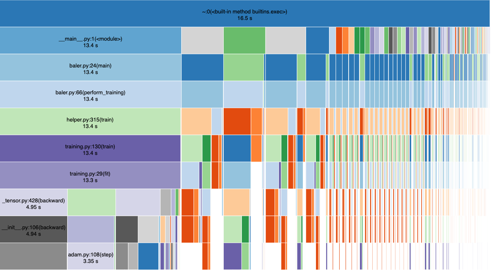
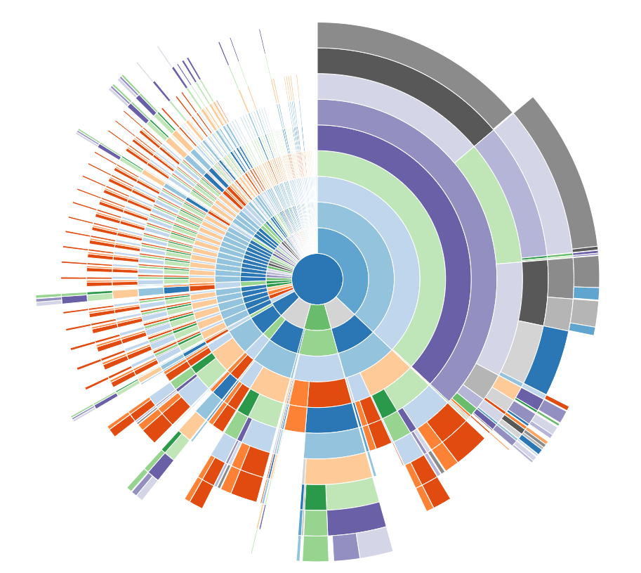
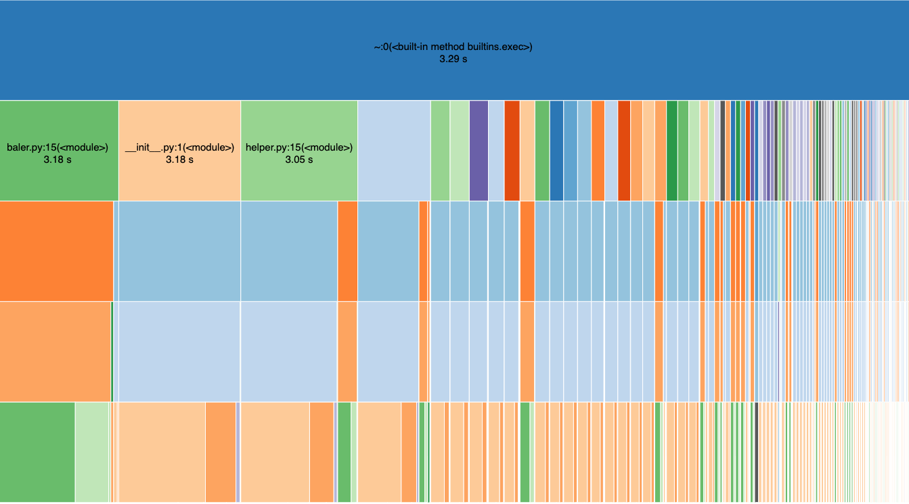
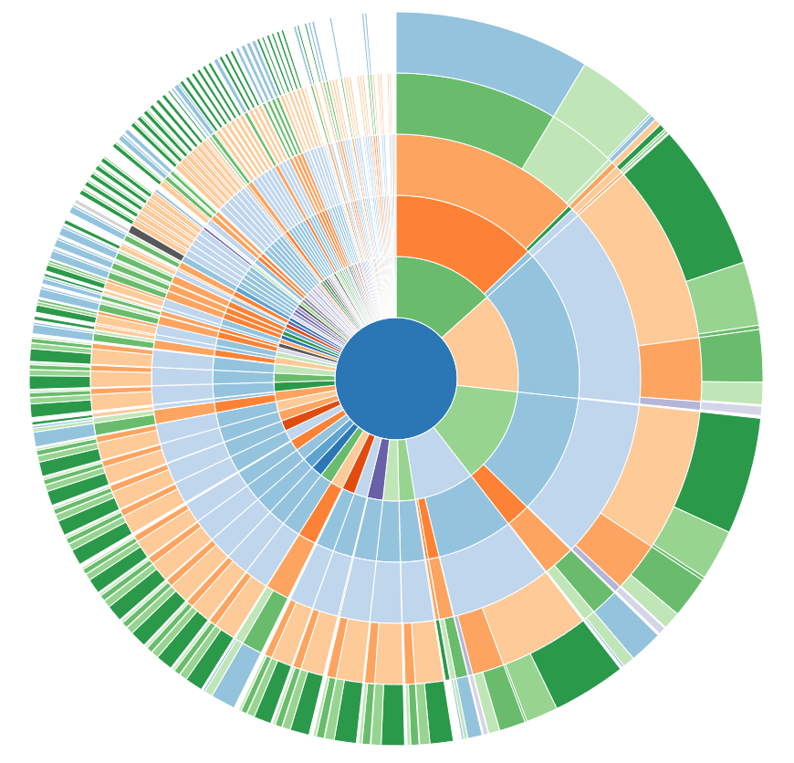
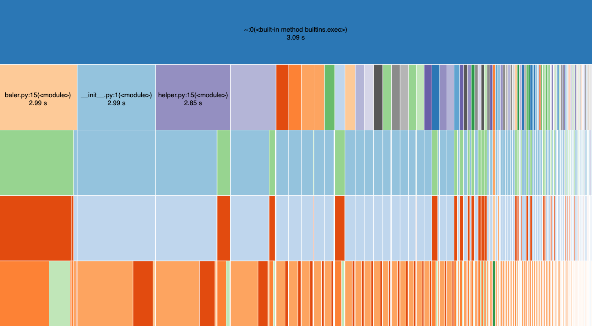
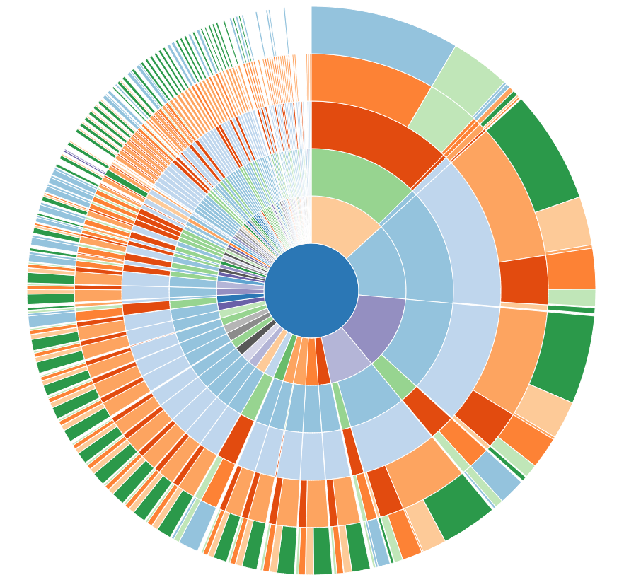
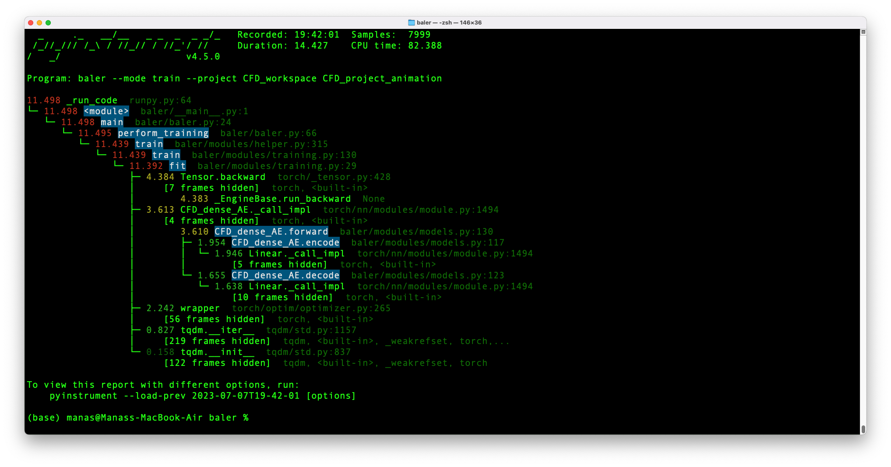
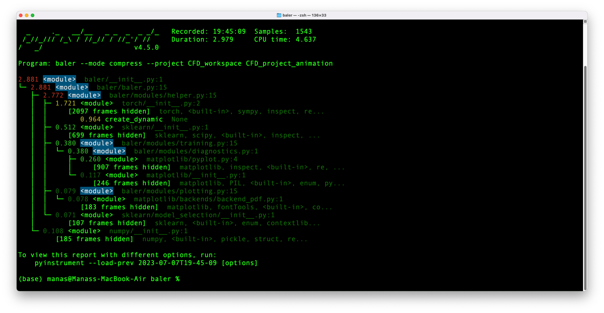

# Google Summer of Code 2023 - CERN 

## Contributor - Manas Pratim Biswas

### Estimating the Energy Cost of a Scientific Software


#### Repository Structure

```
.
├── GSoCEvaluationTask
├── README.md
├── Scaphandre
├── baler
└── cProfile

baler
├── Dockerfile
├── Dockerfile.arm64
├── Dockerfile.gpu
├── LICENSE
├── NOTICE
├── README.md
├── baler
├── bin
├── docs
├── entrypoint.sh
├── fixuid.sh
├── poetry.lock
├── profiling
├── pyproject.toml
├── requirements.txt
├── tests
└── workspaces

baler/profiling
└── cProfile
    ├── cprofile_compress.csv
    ├── cprofile_compress.prof
    ├── cprofile_compress.py
    ├── cprofile_compress.txt
    ├── cprofile_decompress.csv
    ├── cprofile_decompress.prof
    ├── cprofile_decompress.py
    ├── cprofile_decompress.txt
    ├── cprofile_train.csv
    ├── cprofile_train.prof
    ├── cprofile_train.py
    └── cprofile_train.txt
```

#### Profiling Baler with cProfile

- Training
```console
    poetry run python -m cProfile -o profiling/cProfile/cprofile_train.txt -m baler --mode train --project CFD_workspace CFD_project_animation
    poetry run python -m cProfile -o profiling/cProfile/cprofile_train.prof -m baler --mode train --project CFD_workspace CFD_project_animation
```

- Compressing
```console
    poetry run python -m cProfile -o profiling/cProfile/cprofile_compress.txt -m baler --mode compress --project CFD_workspace CFD_project_animation
    poetry run python -m cProfile -o profiling/cProfile/cprofile_compress.prof -m baler --mode compress --project CFD_workspace CFD_project_animation
```

- Decompressing
```console
    poetry run python -m cProfile -o profiling/cProfile/cprofile_decompress.txt -m baler --mode decompress --project CFD_workspace CFD_project_animation
    poetry run python -m cProfile -o profiling/cProfile/cprofile_decompress.prof -m baler --mode decompress --project CFD_workspace CFD_project_animation
```

#### Results

##### Training
---






##### Compressing
---






##### Decompressing
---







#### Profiling Baler with pyinstrument

- Training
```console
    poetry run pyinstrument -m baler --mode train --project CFD_workspace CFD_project_animation
    poetry run pyinstrument -r html -m baler --mode train --project CFD_workspace CFD_project_animation
```

- Compressing
```console
    poetry run pyinstrument -m baler --mode compress --project CFD_workspace CFD_project_animation
    poetry run pyinstrument -r html -m baler --mode compress --project CFD_workspace CFD_project_animation
```

- Decompressing
```console
    poetry run pyinstrument -m baler --mode decompress --project CFD_workspace CFD_project_animation
    poetry run pyinstrument -r html -m baler --mode train --project CFD_workspace CFD_project_animation
```

#### Results

##### Training
---



##### Compressing
---



##### Decompressing
---


### Tools and Frameworks 

#### Profilers:
1. [cProfile](https://docs.python.org/3/library/profile.html)
2. [pyinstrument](https://github.com/joerick/pyinstrument)
3. [experiment-impact-tracker](https://github.com/Breakend/experiment-impact-tracker)
4. [scalene](https://github.com/plasma-umass/scalene)

#### List of the frameworks for Energy Cost Estimation:
1. [scaphandre](https://github.com/hubblo-org/scaphandre)
2. [boagent](https://github.com/Boavizta/boagent)
3. [powermeter](https://github.com/autoai-incubator/powermeter)
4. [powerjoular](https://gitlab.com/joular/powerjoular)
5. [AIPowerMeter](https://github.com/GreenAI-Uppa/AIPowerMeter)


#### List of the frameworks for CO<sub>2</sub> Emissions Estimation:
1. [green-ai](https://github.com/daviddao/green-ai)
2. [carbontracker](https://github.com/lfwa/carbontracker)
3. [Codecarbon](https://github.com/mlco2/codecarbon)
4. [Eco2AI](https://github.com/sb-ai-lab/Eco2AI)
5. [CarbonAI](https://github.com/Capgemini-Invent-France/CarbonAI)
6. [tracarbon](https://github.com/fvaleye/tracarbon)
