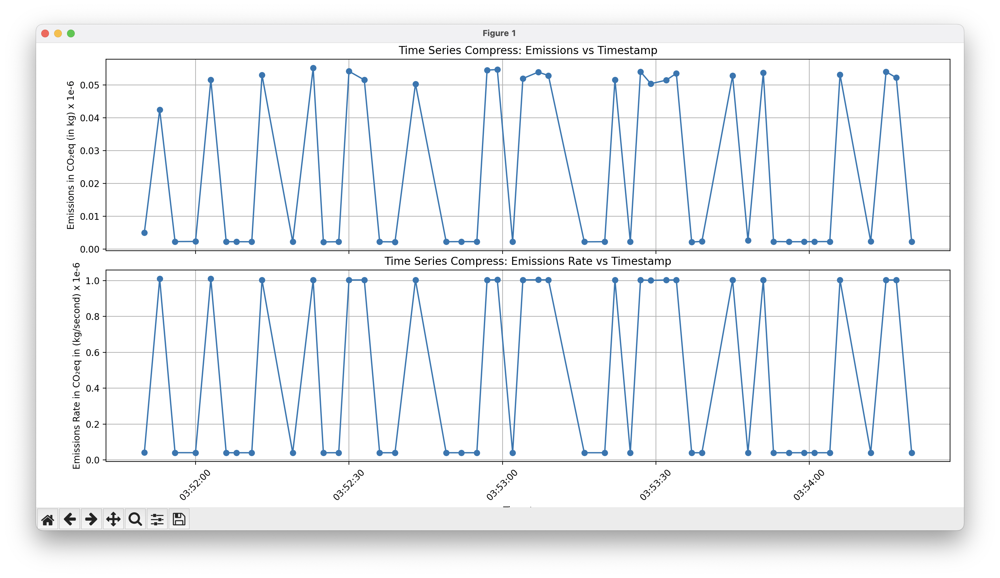
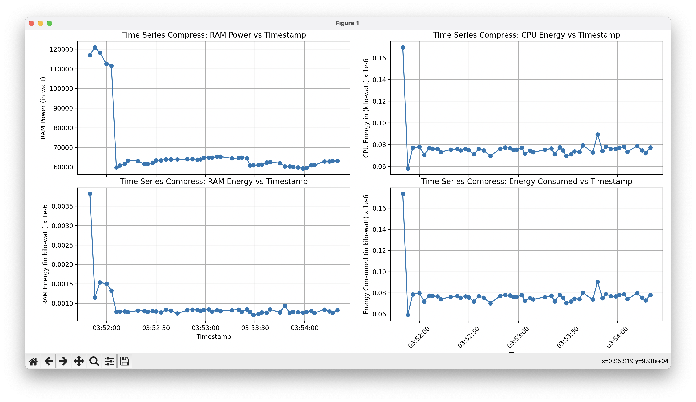

<!--
#### Repository Structure

```
.
├── GSoCEvaluationTask
├── README.md
├── Scaphandre
├── baler
└── cProfile

baler
├── Dockerfile
├── Dockerfile.arm64
├── Dockerfile.gpu
├── LICENSE
├── NOTICE
├── README.md
├── baler
├── bin
├── docs
├── entrypoint.sh
├── fixuid.sh
├── poetry.lock
├── profiling
├── pyproject.toml
├── requirements.txt
├── tests
└── workspaces

baler/profiling
└── cProfile
    ├── cprofile_compress.csv
    ├── cprofile_compress.prof
    ├── cprofile_compress.py
    ├── cprofile_compress.txt
    ├── cprofile_decompress.csv
    ├── cprofile_decompress.prof
    ├── cprofile_decompress.py
    ├── cprofile_decompress.txt
    ├── cprofile_train.csv
    ├── cprofile_train.prof
    ├── cprofile_train.py
    └── cprofile_train.txt
```

#### Profiling Baler with ``` cProfile ```

- Training
```console
    poetry run python -m cProfile -o profiling/cProfile/cprofile_train.txt -m baler --mode train --project CFD_workspace CFD_project_animation
    poetry run python -m cProfile -o profiling/cProfile/cprofile_train.prof -m baler --mode train --project CFD_workspace CFD_project_animation
```

- Compressing
```console
    poetry run python -m cProfile -o profiling/cProfile/cprofile_compress.txt -m baler --mode compress --project CFD_workspace CFD_project_animation
    poetry run python -m cProfile -o profiling/cProfile/cprofile_compress.prof -m baler --mode compress --project CFD_workspace CFD_project_animation
```

- Decompressing
```console
    poetry run python -m cProfile -o profiling/cProfile/cprofile_decompress.txt -m baler --mode decompress --project CFD_workspace CFD_project_animation
    poetry run python -m cProfile -o profiling/cProfile/cprofile_decompress.prof -m baler --mode decompress --project CFD_workspace CFD_project_animation
```

#### Visualizing with ``` SnakeViz ``` and ``` yelp-gprof2dot ```


- Installing ``` SnakeViz ``` and ``` yelp-gprof2dot ```
```console
    poetry add snakeviz
    poetry add yelp-gprof2dot
```

- Training
```console
    poetry run snakeviz cProfile_train.prof
    poetry run gprof2dot cprofile_train.pstats -z <graph_root> | dot -Tsvg -o cprofile_train.svg
    poetry run gprof2dot cprofile_train.pstats -z <graph_root> | dot -Tsvg -o cprofile_train.pdf
```

- Compressing
```console
    poetry run snakeviz cProfile_compress.prof
    poetry run gprof2dot cprofile_compress.pstats -z <graph_root> | dot -Tsvg -o cprofile_compress.svg
    poetry run gprof2dot cprofile_compress.pstats -z <graph_root> | dot -Tpdf -o cprofile_compress.pdf
```


- Decompressing
```console
    poetry run snakeviz cProfile_decompress.prof
    poetry run gprof2dot cprofile_decompress.pstats -z <graph_root> | dot -Tsvg -o cprofile_decompress.svg
    poetry run gprof2dot cprofile_decompress.pstats -z <graph_root> | dot -Tpdf -o cprofile_decompress.pdf
```

#### Results

##### Training
---


##### Compressing
---


##### Decompressing
---


#### Profiling Baler with ``` pyinstrument ```


- Installing ``` pyinstrument ```
```console
    poetry add pyinstrument
```

- Training
```console
    poetry run pyinstrument -m baler --mode train --project CFD_workspace CFD_project_animation
    poetry run pyinstrument -r html -m baler --mode train --project CFD_workspace CFD_project_animation
```

- Compressing
```console
    poetry run pyinstrument -m baler --mode compress --project CFD_workspace CFD_project_animation
    poetry run pyinstrument -r html -m baler --mode compress --project CFD_workspace CFD_project_animation
```

- Decompressing
```console
    poetry run pyinstrument -m baler --mode decompress --project CFD_workspace CFD_project_animation
    poetry run pyinstrument -r html -m baler --mode train --project CFD_workspace CFD_project_animation
```

#### Results

##### Training
---


##### Compressing
---


##### Decompressing
---


#### Profiling Baler with ``` memory-profiler ```


- Installing ``` memory-profiler ```
```console
    poetry add memory-profiler
```

- Training
```console
    poetry run mprof run --python baler --mode train --project CFD_workspace CFD_project_animation
    poetry run mprof plot -t train_slope  -s
    poetry run mprof plot -t train_flame  -f
```

- Compressing
```console
   poetry run mprof run --python baler --mode compress --project CFD_workspace CFD_project_animation
   poetry run mprof plot -t compress_slope -s
   poetry run mprof plot -t compress_flame -f
```

- Decompressing
```console
    poetry run mprof run --python baler --mode decompress --project CFD_workspace CFD_project_animation
    poetry run mprof plot -t decompress_slope -s
    poetry run mprof plot -t decompress_flame -f
```


#### Results

##### Training
---


##### Compressing
---


##### Decompressing
---


#### Profiling Baler with ``` powermetrics ``` and ``` influxdb ```

- Installing ``` influxdb ```
```console
    brew install influxdb
    poetry add influxdb-client
```

- ``` Run powermetrics in a terminal ```
```console
    sudo poetry run python influxdb.py
```

- ``` Query the influxdb with flux cpu query ```
```console
from(bucket: "baler")
  |> range(start: v.timeRangeStart, stop: v.timeRangeStop)
  |> filter(fn: (r) => r["_measurement"] == "CPU")
  |> map(fn: (r) => ({ r with _value: float(v:r._value)/1000.00}))
  |> aggregateWindow(every: v.windowPeriod, fn: mean, createEmpty: false)
  |> yield(name: "last")
```

- ``` Query the influxdb with flux gpu query ```
```console
from(bucket: "baler")
  |> range(start: v.timeRangeStart, stop: v.timeRangeStop)
  |> filter(fn: (r) => r["_measurement"] == "GPU")
  |> map(fn: (r) => ({ r with _value: float(v:r._value)/1000.00}))
  |> aggregateWindow(every: v.windowPeriod, fn: mean, createEmpty: false)
  |> yield(name: "last")
```

- ``` Query the influxdb with flux total query ```
```console
from(bucket: "baler")
  |> range(start: v.timeRangeStart, stop: v.timeRangeStop)
  |> filter(fn: (r) => r["_measurement"] == "Package")
  |> map(fn: (r) => ({ r with _value: float(v:r._value)/1000.00}))
  |> aggregateWindow(every: v.windowPeriod, fn: mean, createEmpty: false)
  |> yield(name: "last")
```
- ``` Run baler with usual commands on train, compress and decompress modes on a different terminal ```

#### Results

##### Training
---


---


##### Compressing
---


---


##### Decompressing
---


---


#### Estimating CO<sub>2</sub> Emission with ``` codecarbon ```

- Installing ``` codecarbon ```
```console
    poetry add codecarbon
```


##### ``` A scaling factor of 1e6 has been used to generate the plots for 50 baler runs with 1000 epochs each ```

##### Training
---


---


---


---


##### Compressing
---


---


---


---


##### Decompressing
---


---


---


---


### Tools and Frameworks

#### CPU/GPU Profilers:
1. [cProfile](https://docs.python.org/3/library/profile.html)
2. [pyinstrument](https://github.com/joerick/pyinstrument)
3. [experiment-impact-tracker](https://github.com/Breakend/experiment-impact-tracker)
4. [scalene](https://github.com/plasma-umass/scalene)


#### Memory Profilers:
1. [memory-profiler](https://pypi.org/project/memory-profiler/)
2. [memray](https://github.com/bloomberg/memray)
3. [filprofiler](https://github.com/Breakend/experiment-impact-https://github.com/pythonspeed/filprofiler)


#### List of the frameworks for Energy Cost Estimation:
1. [powermetrics](https://www.unix.com/man-page/osx/1/powermetrics/) with [influxdb](https://github.com/influxdata/influxdb)
2. [scaphandre](https://github.com/hubblo-org/scaphandre)
3. [boagent](https://github.com/Boavizta/boagent)
4. [powermeter](https://github.com/autoai-incubator/powermeter)
5. [powerjoular](https://gitlab.com/joular/powerjoular)
6. [AIPowerMeter](https://github.com/GreenAI-Uppa/AIPowerMeter)


#### List of the frameworks for CO<sub>2</sub> Emissions Estimation:
1. [carbontracker](https://github.com/lfwa/carbontracker)
2. [codecarbon](https://github.com/mlco2/codecarbon)
3. [Eco2AI](https://github.com/sb-ai-lab/Eco2AI)
4. [CarbonAI](https://github.com/Capgemini-Invent-France/CarbonAI)
5. [tracarbon](https://github.com/fvaleye/tracarbon) -->

# Google Summer of Code 2023

## Contributor : _Manas Pratim Biswas_

## Description

- **Year**: 2023
- **Organisation**: [CERN-HSF](https://hepsoftwarefoundation.org) 
- **Project Title**: [Estimating the Energy Cost of Scientific Software](https://summerofcode.withgoogle.com/programs/2023/projects/Nks9akq7)
- **Project Proposal**: [Estimating the Energy Cost of Scientific Software](https://drive.google.com/file/d/1YoCpkYWR__KB4vVzKOA4xi1qgwwFzpU5/view)
- **Repository**: [baler-collaboration/baler](https://github.com/baler-collaboration/baler)
- **Mentor**: [Caterina Doglioni](https://www.hep.lu.se/staff/doglioni/) ([@urania277](https://github.com/urania277))
- **Project Size**: Large

<br/>

## Project Details

Estimate the energy efficiency and performance of a scientific software - _Baler_ and attempt to identify where this efficiency can be improved. 

> **Background**: The _Large Hadron Collider (LHC) experiments_  generate massive datasets composed of billions of _proton-proton_ collisions. The analysis of this data requires _high-throughput scientific computing_ that relies on efficient software algorithms. In today’s world, where **energy crisis** and **environmental issues** are becoming more pressing concerns, it is crucial that we start taking action to develop sustainable software solutions. As scientific software is being used more and more in high-throughput computing, there is a growing need to optimize its _energy efficiency_ and reduce its _carbon footprint_.

<br/>

## Project Report

## Contributions 

Throughout the summer, I have spent most of my time exploring profilers and learning about profiling small code snippets and softwares in general. I have profiled _Baler_ with multiple profilers with varied techniques.

| No. | Profiler/Tool                                                                                                                               | Description                                                                                                                                                                                                                                                                                                                                                                                                       |
| --- | ------------------------------------------------------------------------------------------------------------------------------------------- | ----------------------------------------------------------------------------------------------------------------------------------------------------------------------------------------------------------------------------------------------------------------------------------------------------------------------------------------------------------------------------------------------------------------- |
| 1   | [cProfile](https://docs.python.org/3/library/profile.html)                                                                                  | cProfile provides [_Deterministic Profiling_](https://sceweb.sce.uhcl.edu/helm/WEBPAGE-Python/documentation/python_tutorial/lib/Deterministic_Profiling.html) of Python programs. A profile is a set of statistics that describes how often and for how long various parts of the program executed. Is measures the [_CPU_](https://pythonspeed.com/articles/blocking-cpu-or-io) time                             |
| 2   | [pyinstruments](https://github.com/joerick/pyinstrument)                                                                                    | pyinstruments provides [_Statistical Profiling_](<https://en.wikipedia.org/wiki/Profiling_(computer_programming)>) of Python programs. It doesn’t track every function call that the program makes. Instead, it records the call stack every 1ms and measures the [_Wall Clock_](https://stackoverflow.com/questions/7335920/what-specifically-are-wall-clock-time-user-cpu-time-and-system-cpu-time-in-uni) time |
| 3   | [experiment-impact-tracker](https://github.com/Breakend/experiment-impact-tracker)                                                          | lorem ipsum                                                                                                                                                                                                                                                                                                                                                                                                            |
| 4   | [scalene](https://github.com/plasma-umass/scalene)                                                                                          | lorem ipsum                                                                                                                                                                                                                                                                                                                                                                                                           |
| 5   | [memory-profiler](https://pypi.org/project/memory-profiler)                                                                                 | lorem ipsum                                                                                                                                                                                                                                                                                                                                                                                                           |
| 6   | [memray](https://github.com/bloomberg/memray)                                                                                               | lorem ipsum                                                                                                                                                                                                                                                                                                                                                                                                           |
| 7   | [codecarbon](https://github.com/mlco2/codecarbon)                                                                                           | lorem ipsum                                                                                                                                                                                                                                                                                                                                                                                                            |
| 8   | [Eco2AI](https://github.com/sb-ai-lab/Eco2AI)                                                                                               | lorem ipsum                                                                                                                                                                                                                                                                                                                                                                                                             |
| 9   | [powermetrics](https://www.unix.com/man-page/osx/1/powermetrics) & [influxDB](https://abhimanbhau.github.io/mac/m1-mac-power-usage-monitor) | lorem ipsum                                                                                                                                                                                                                                                                                                                                                                                                         |

I have incorporated some of the profilers into the `baler` codebase and made the multiple commits spread across the subsequent Pull Requests at [baler-collaboration/baler](https://github.com/baler-collaboration/baler) in the reverse chronological order

- [ ] Visualize cProfile logs and dumps ([**PR #331**](https://github.com/baler-collaboration/baler/pull/331))

<br/>

- [ ] Implement codecarbon plots ([**PR #330**](https://github.com/baler-collaboration/baler/pull/330))

<br/>

- [x] Added -m flag while training baler. Fixes Import Error ([**PR #286**](https://github.com/baler-collaboration/baler/pull/286))

<br />

- [x] MacOS Installation Issues ([**PR #280**](https://github.com/baler-collaboration/baler/pull/280))

<br/>

## References

[1] Baler - Machine Learning Based Compression of Scientific Data &nbsp; ([**LINK**🔗](https://arxiv.org/pdf/2305.02283.pdf))

[2] Towards the Systematic Reporting of the Energy and Carbon
Footprints of Machine Learning &nbsp; ([**LINK**🔗](https://jmlr.org/papers/volume21/20-312/20-312.pdf))

[3] Green Software Foundation &nbsp; ([**LINK**🔗](https://greensoftware.foundation))

[4] Green Algorithms: Quantifying the Carbon Footprintof Computation &nbsp; ([**LINK**🔗](https://onlinelibrary.wiley.com/doi/epdf/10.1002/advs.202100707))

<br/>

## License

Copyright 2023 Baler-Collaboration. Distributed under the Apache License 2.0. See [`LICENSE`](https://github.com/baler-collaboration/baler/blob/main/LICENSE) for more information.

<br/>

## Summary

Participating in **Google Summer of Code** (GSoC) for the first very first time was an exhilarating experience for me. I'm immensely grateful to my mentor, [Caterina Doglioni](https://www.hep.lu.se/staff/doglioni/), for this opportunity. I am thankful for her invaluable guidance, feedback and understanding during my tough times through the project.

> Special Thanks to [**Leonid Didukh**](https://www.linkedin.com/in/ledidukh) ([@neogyk](https://github.com/neogyk)) for providing immense support and help throughout the program and [**Anirban Mukerjee**](https://www.linkedin.com/in/anirbanm1728) ([@anirbanm1728](https://github.com/anirbanm1728)) & [**Krishnaneel Dey**](https://www.linkedin.com/in/krishnaneel-dey) ([@Krishnaneel](https://github.com/Krishnaneel)) for their valuable feedback on the proposal.

Beyond GSoC, I'm committed to ongoing contributions to the organization.Feel free to connect on LinkedIn for any suggestions and feedback! 😄
