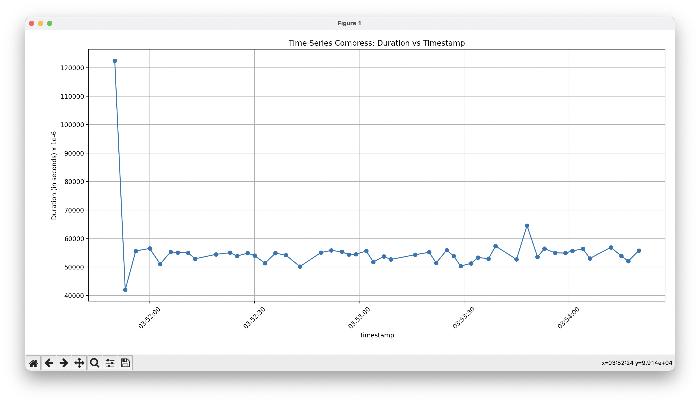
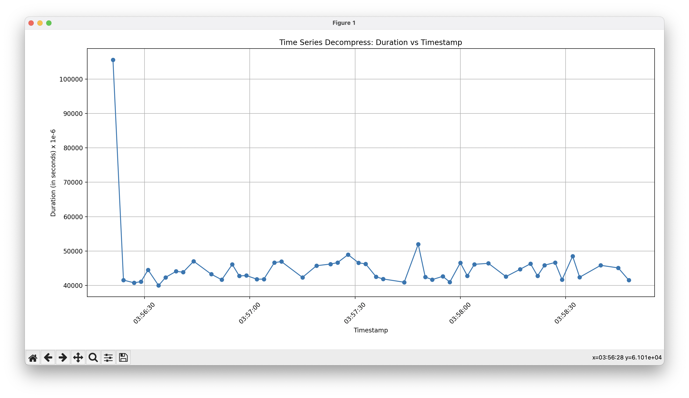
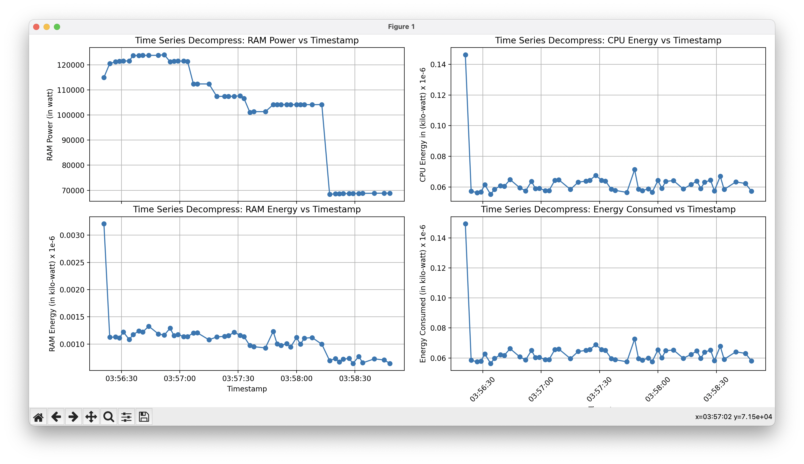

<!--
#### Repository Structure

```
.
├── GSoCEvaluationTask
├── README.md
├── Scaphandre
├── baler
└── cProfile

baler
├── Dockerfile
├── Dockerfile.arm64
├── Dockerfile.gpu
├── LICENSE
├── NOTICE
├── README.md
├── baler
├── bin
├── docs
├── entrypoint.sh
├── fixuid.sh
├── poetry.lock
├── profiling
├── pyproject.toml
├── requirements.txt
├── tests
└── workspaces

baler/profiling
└── cProfile
    ├── cprofile_compress.csv
    ├── cprofile_compress.prof
    ├── cprofile_compress.py
    ├── cprofile_compress.txt
    ├── cprofile_decompress.csv
    ├── cprofile_decompress.prof
    ├── cprofile_decompress.py
    ├── cprofile_decompress.txt
    ├── cprofile_train.csv
    ├── cprofile_train.prof
    ├── cprofile_train.py
    └── cprofile_train.txt
```

#### Profiling Baler with ``` cProfile ```

- Training
```console
    poetry run python -m cProfile -o profiling/cProfile/cprofile_train.txt -m baler --mode train --project CFD_workspace CFD_project_animation
    poetry run python -m cProfile -o profiling/cProfile/cprofile_train.prof -m baler --mode train --project CFD_workspace CFD_project_animation
```

- Compressing
```console
    poetry run python -m cProfile -o profiling/cProfile/cprofile_compress.txt -m baler --mode compress --project CFD_workspace CFD_project_animation
    poetry run python -m cProfile -o profiling/cProfile/cprofile_compress.prof -m baler --mode compress --project CFD_workspace CFD_project_animation
```

- Decompressing
```console
    poetry run python -m cProfile -o profiling/cProfile/cprofile_decompress.txt -m baler --mode decompress --project CFD_workspace CFD_project_animation
    poetry run python -m cProfile -o profiling/cProfile/cprofile_decompress.prof -m baler --mode decompress --project CFD_workspace CFD_project_animation
```

#### Visualizing with ``` SnakeViz ``` and ``` yelp-gprof2dot ```


- Installing ``` SnakeViz ``` and ``` yelp-gprof2dot ```
```console
    poetry add snakeviz
    poetry add yelp-gprof2dot
```

- Training
```console
    poetry run snakeviz cProfile_train.prof
    poetry run gprof2dot cprofile_train.pstats -z <graph_root> | dot -Tsvg -o cprofile_train.svg
    poetry run gprof2dot cprofile_train.pstats -z <graph_root> | dot -Tsvg -o cprofile_train.pdf
```

- Compressing
```console
    poetry run snakeviz cProfile_compress.prof
    poetry run gprof2dot cprofile_compress.pstats -z <graph_root> | dot -Tsvg -o cprofile_compress.svg
    poetry run gprof2dot cprofile_compress.pstats -z <graph_root> | dot -Tpdf -o cprofile_compress.pdf
```


- Decompressing
```console
    poetry run snakeviz cProfile_decompress.prof
    poetry run gprof2dot cprofile_decompress.pstats -z <graph_root> | dot -Tsvg -o cprofile_decompress.svg
    poetry run gprof2dot cprofile_decompress.pstats -z <graph_root> | dot -Tpdf -o cprofile_decompress.pdf
```

#### Results

##### Training
---


##### Compressing
---


##### Decompressing
---


#### Profiling Baler with ``` pyinstrument ```


- Installing ``` pyinstrument ```
```console
    poetry add pyinstrument
```

- Training
```console
    poetry run pyinstrument -m baler --mode train --project CFD_workspace CFD_project_animation
    poetry run pyinstrument -r html -m baler --mode train --project CFD_workspace CFD_project_animation
```

- Compressing
```console
    poetry run pyinstrument -m baler --mode compress --project CFD_workspace CFD_project_animation
    poetry run pyinstrument -r html -m baler --mode compress --project CFD_workspace CFD_project_animation
```

- Decompressing
```console
    poetry run pyinstrument -m baler --mode decompress --project CFD_workspace CFD_project_animation
    poetry run pyinstrument -r html -m baler --mode train --project CFD_workspace CFD_project_animation
```

#### Results

##### Training
---


##### Compressing
---


##### Decompressing
---


#### Profiling Baler with ``` memory-profiler ```


- Installing ``` memory-profiler ```
```console
    poetry add memory-profiler
```

- Training
```console
    poetry run mprof run --python baler --mode train --project CFD_workspace CFD_project_animation
    poetry run mprof plot -t train_slope  -s
    poetry run mprof plot -t train_flame  -f
```

- Compressing
```console
   poetry run mprof run --python baler --mode compress --project CFD_workspace CFD_project_animation
   poetry run mprof plot -t compress_slope -s
   poetry run mprof plot -t compress_flame -f
```

- Decompressing
```console
    poetry run mprof run --python baler --mode decompress --project CFD_workspace CFD_project_animation
    poetry run mprof plot -t decompress_slope -s
    poetry run mprof plot -t decompress_flame -f
```


#### Results

##### Training
---


##### Compressing
---


##### Decompressing
---


#### Profiling Baler with ``` powermetrics ``` and ``` influxdb ```

- Installing ``` influxdb ```
```console
    brew install influxdb
    poetry add influxdb-client
```

- ``` Run powermetrics in a terminal ```
```console
    sudo poetry run python influxdb.py
```

- ``` Query the influxdb with flux cpu query ```
```console
from(bucket: "baler")
  |> range(start: v.timeRangeStart, stop: v.timeRangeStop)
  |> filter(fn: (r) => r["_measurement"] == "CPU")
  |> map(fn: (r) => ({ r with _value: float(v:r._value)/1000.00}))
  |> aggregateWindow(every: v.windowPeriod, fn: mean, createEmpty: false)
  |> yield(name: "last")
```

- ``` Query the influxdb with flux gpu query ```
```console
from(bucket: "baler")
  |> range(start: v.timeRangeStart, stop: v.timeRangeStop)
  |> filter(fn: (r) => r["_measurement"] == "GPU")
  |> map(fn: (r) => ({ r with _value: float(v:r._value)/1000.00}))
  |> aggregateWindow(every: v.windowPeriod, fn: mean, createEmpty: false)
  |> yield(name: "last")
```

- ``` Query the influxdb with flux total query ```
```console
from(bucket: "baler")
  |> range(start: v.timeRangeStart, stop: v.timeRangeStop)
  |> filter(fn: (r) => r["_measurement"] == "Package")
  |> map(fn: (r) => ({ r with _value: float(v:r._value)/1000.00}))
  |> aggregateWindow(every: v.windowPeriod, fn: mean, createEmpty: false)
  |> yield(name: "last")
```
- ``` Run baler with usual commands on train, compress and decompress modes on a different terminal ```

#### Results

##### Training
---


---


##### Compressing
---


---


##### Decompressing
---


---


#### Estimating CO<sub>2</sub> Emission with ``` codecarbon ```

- Installing ``` codecarbon ```
```console
    poetry add codecarbon
```


##### ``` A scaling factor of 1e6 has been used to generate the plots for 50 baler runs with 1000 epochs each ```

##### Training
---


---


---


---


##### Compressing
---


---


---


---


##### Decompressing
---


---


---


---


### Tools and Frameworks

#### CPU/GPU Profilers:
1. [cProfile](https://docs.python.org/3/library/profile.html)
2. [pyinstrument](https://github.com/joerick/pyinstrument)
3. [experiment-impact-tracker](https://github.com/Breakend/experiment-impact-tracker)
4. [scalene](https://github.com/plasma-umass/scalene)


#### Memory Profilers:
1. [memory-profiler](https://pypi.org/project/memory-profiler/)
2. [memray](https://github.com/bloomberg/memray)
3. [filprofiler](https://github.com/Breakend/experiment-impact-https://github.com/pythonspeed/filprofiler)


#### List of the frameworks for Energy Cost Estimation:
1. [powermetrics](https://www.unix.com/man-page/osx/1/powermetrics/) with [influxdb](https://github.com/influxdata/influxdb)
2. [scaphandre](https://github.com/hubblo-org/scaphandre)
3. [boagent](https://github.com/Boavizta/boagent)
4. [powermeter](https://github.com/autoai-incubator/powermeter)
5. [powerjoular](https://gitlab.com/joular/powerjoular)
6. [AIPowerMeter](https://github.com/GreenAI-Uppa/AIPowerMeter)


#### List of the frameworks for CO<sub>2</sub> Emissions Estimation:
1. [carbontracker](https://github.com/lfwa/carbontracker)
2. [codecarbon](https://github.com/mlco2/codecarbon)
3. [Eco2AI](https://github.com/sb-ai-lab/Eco2AI)
4. [CarbonAI](https://github.com/Capgemini-Invent-France/CarbonAI)
5. [tracarbon](https://github.com/fvaleye/tracarbon) -->

# Google Summer of Code 2023

## Contributor : _Manas Pratim Biswas_

## Description

- **Year**: 2023
- **Organisation**: [CERN-HSF](https://hepsoftwarefoundation.org) 
- **Project Title**: [Estimating the Energy Cost of Scientific Software](https://summerofcode.withgoogle.com/programs/2023/projects/Nks9akq7)
- **Project Proposal**: [Estimating the Energy Cost of Scientific Software](https://drive.google.com/file/d/1YoCpkYWR__KB4vVzKOA4xi1qgwwFzpU5/view)
- **Repository**: [baler-collaboration/baler](https://github.com/baler-collaboration/baler)
- **Mentor**: [Caterina Doglioni](https://www.hep.lu.se/staff/doglioni/) ([@urania277](https://github.com/urania277))
- **Project Size**: Large

<br/>

## Project Details

Estimate the energy efficiency and performance of a scientific software - _Baler_ and attempt to identify where this efficiency can be improved. 

> **Background**: The _Large Hadron Collider (LHC) experiments_  generate massive datasets composed of billions of _proton-proton_ collisions. The analysis of this data requires _high-throughput scientific computing_ that relies on efficient software algorithms. In today’s world, where **energy crisis** and **environmental issues** are becoming more pressing concerns, it is crucial that we start taking action to develop sustainable software solutions. As scientific software is being used more and more in high-throughput computing, there is a growing need to optimize its _energy efficiency_ and reduce its _carbon footprint_.

<br/>

## Project Report

> _The Baler project is a collaboration between 12 research physicists, computer scientists, and machine learning experts at the universities of Lund, Manchester, and Uppsala. Baler, is a tool that uses machine learning to derive a compression that is tailored to the user’s input data, achieving large data reduction and high fidelity where it matters. [Read more about Baler](https://baler-collaboration.github.io)_

Throughout the summer, I have spent most of my time exploring profilers and learning about profiling small code snippets and softwares in general.

Initially, I profiled _Baler_ with multiple profilers with varied techniques. Some profilers like _codecarbon_ had to be used as _**wrappers**_ or invoked as _**APIs**_ while others like _cProfile_, _pyinstruments_, _powermetrics_ had to be used as standalone commands with optional `-flags` directly from the terminal.

### 💡 Visualizing cProfile logs

#### How to profile Baler using cProfile ?

Baler can be profiled with cProfile by adding the flag `--cProfile` while training

Example:

```bash
poetry run baler --project CFD_workspace CFD_project_animation --mode train --cProfile
```

The profile logs will be stored at:
`workspaces/CFD_workspace/CFD_project_animation/output/profiling/`

Note: A Keyboard Interrupt is necessary to stop and exit from the _SnakeViz_ server

_cProfile profiles visualized using SnakeViz_


_call stack of cProfile_


🕓 The majority time is taken by the `optimizer` for performing the gradient descent

#### Directed Graphs (Di Graphs):

- A directed graph (digraph) is a graph that is made up of vertices (nodes) connected by directed edges.
- In the context of profiling, a directed graph can represent the flow of program execution. Nodes may correspond to functions or code blocks, and edges indicate the direction of execution from one node to another.

#### Call Graphs:

- A call graph is a type of directed graph that represents the relationships between functions in a program.
- In the context of profiling, a call graph visualizes how functions call each other during program execution. Each node in the graph typically corresponds to a function, and directed edges show the flow of control from one function to another.

#### Usage:

- Di graphs and call graphs are powerful tools for profiling and optimization, offering insights into the structure and behavior of the code.
- Visualization aids in comprehending complex relationships between functions, making it easier to comprehend the call order and time taken by the various parts of the function calls.

_This is the call graph generated, rooted at the `perform_training()` function when baler is trained for 2000 epochs on the CFD Dataset_


🕓 The majority time is taken by the `optimizer` for performing the gradient descent
🕓 The _Back Propagation_ takes more time than _Forward Propagation_

Hence, the results are in compliance with each other

### 💡 Visualizing codecarbon logs

| No. | Profiler/Tool                                                                                                                                    | Description                                                                                                                                                                                                                                                                                                                                                                                                                                                                                                                                                                                                                                                                                                                                      |
| --- | ------------------------------------------------------------------------------------------------------------------------------------------------ | ------------------------------------------------------------------------------------------------------------------------------------------------------------------------------------------------------------------------------------------------------------------------------------------------------------------------------------------------------------------------------------------------------------------------------------------------------------------------------------------------------------------------------------------------------------------------------------------------------------------------------------------------------------------------------------------------------------------------------------------------ |
| 1   | [cProfile](https://docs.python.org/3/library/profile.html)                                                                                       | _cProfile_ provides [_Deterministic Profiling_](https://sceweb.sce.uhcl.edu/helm/WEBPAGE-Python/documentation/python_tutorial/lib/Deterministic_Profiling.html) of Python programs. A profile is a set of statistics that describes how often and for how long various parts of the program executed. Is measures the [_CPU_](https://pythonspeed.com/articles/blocking-cpu-or-io) time                                                                                                                                                                                                                                                                                                                                                          |
| 2   | [pyinstruments](https://github.com/joerick/pyinstrument)                                                                                         | _pyinstruments_ provides [_Statistical Profiling_](<https://en.wikipedia.org/wiki/Profiling_(computer_programming)>) of Python programs. It doesn’t track every function call that the program makes. Instead, it records the call stack every 1ms and measures the [_Wall Clock_](https://stackoverflow.com/questions/7335920/what-specifically-are-wall-clock-time-user-cpu-time-and-system-cpu-time-in-uni) time                                                                                                                                                                                                                                                                                                                              |
| 3   | [experiment-impact-tracker](https://github.com/Breakend/experiment-impact-tracker)                                                               | _experiment-impact-tracker_ tracks energy usage, carbon emissions, and compute utilization of the system. Currently, on Linux systems with Intel chips (that support the _RAPL_ or _powergadget_ interfaces) and _NVIDIA GPUs_. It records power draw from CPU and GPU, hardware information, python package versions and estimated carbon emissions information                                                                                                                                                                                                                                                                                                                                                                                 |
| 4   | [scalene](https://github.com/plasma-umass/scalene)                                                                                               | _Scalene_ is a high-performance CPU, GPU and memory profiler for Python that incorporates AI-powered proposed optimizations                                                                                                                                                                                                                                                                                                                                                                                                                                                                                                                                                                                                                      |
| 5   | [memory-profiler](https://pypi.org/project/memory-profiler)                                                                                      | _memory-profiler_ is a python module for monitoring memory consumption of a process as well as line-by-line analysis of memory consumption for python programs                                                                                                                                                                                                                                                                                                                                                                                                                                                                                                                                                                                   |
| 6   | [memray](https://github.com/bloomberg/memray)                                                                                                    | _Memray_ is a memory profiler for Python. It can track memory allocations in Python code, in native extension modules, and in the Python interpreter itself. It can generate several different types of reports to analyze the captured memory usage data.                                                                                                                                                                                                                                                                                                                                                                                                                                                                                       |
| 7   | [codecarbon](https://github.com/mlco2/codecarbon)                                                                                                | _codecarbon_ is a Python package that estimates the hardware electricity power consumption (GPU + CPU + RAM) and apply to it the carbon intensity of the region where the computing is done. The [_methodology_](https://mlco2.github.io/codecarbon/methodology.html) behind the package involves the use a scheduler that, by default, call for the measure every 15 seconds and measures the CO₂ as per the formula `Carbon dioxide emissions (CO₂eq) = C * E `. <br /> <br /> Here, `C` = Carbon Intensity of the electricity consumed for computation: quantified as g of CO₂ emitted per kilowatt-hour of electricity and `E` = Energy Consumed by the computational infrastructure: quantified as kilowatt-hours.                          |
| 8   | [Eco2AI](https://github.com/sb-ai-lab/Eco2AI)                                                                                                    | _Eco2AI_ is a Python library for CO₂ emission tracking. It monitors energy consumption of CPU & GPU devices and estimates equivalent carbon emissions taking into account the regional emission coefficient.                                                                                                                                                                                                                                                                                                                                                                                                                                                                                                                                     |
| 9   | [powermetrics](https://www.unix.com/man-page/osx/1/powermetrics) _with_ [influxDB](https://abhimanbhau.github.io/mac/m1-mac-power-usage-monitor) | _powermetrics_ gathers and displays CPU usage statistics (divided into time spent in user mode and supervisor mode), timer and interrupt wake-up frequency (total and, for near-idle workloads, those that resulted in package idle exits), and on supported platforms,interrupt frequencies (categorized by CPU number), package C-state statistics (an indication of the time the core complex + integrated graphics, if any, were in low-power idle states), as well as the average execution frequency for each CPU when not idle. This comes with as a default with _UNIX_ and therefore can be considered a standard. <br /><br /> _influxDB_ is a time-series database that can be used to visualize the logs generated by _powermetrics_ |

## Contributions 

I have incorporated some of the profilers into the `baler` codebase and made multiple commits spread across the subsequent Pull Requests at [baler-collaboration/baler](https://github.com/baler-collaboration/baler) and listed in the reverse chronological order

- [x] Visualize cProfile logs and dumps ([**PR #331**](https://github.com/baler-collaboration/baler/pull/331)) 🟨

<br/>

- [x] Implement codecarbon plots ([**PR #330**](https://github.com/baler-collaboration/baler/pull/330)) 🟨

<br/>

- [x] Added -m flag while training baler. Fixes Import Error ([**PR #286**](https://github.com/baler-collaboration/baler/pull/286)) 🟥

<br />

- [x] MacOS Installation Issues ([**PR #280**](https://github.com/baler-collaboration/baler/pull/280)) 🟥

<br/>

## References

[1] Baler - Machine Learning Based Compression of Scientific Data &nbsp; ([**LINK**🔗](https://arxiv.org/pdf/2305.02283.pdf))

[2] Towards the Systematic Reporting of the Energy and Carbon
Footprints of Machine Learning &nbsp; ([**LINK**🔗](https://jmlr.org/papers/volume21/20-312/20-312.pdf))

[3] Green Software Foundation &nbsp; ([**LINK**🔗](https://greensoftware.foundation))

[4] Green Algorithms: Quantifying the Carbon Footprintof Computation &nbsp; ([**LINK**🔗](https://onlinelibrary.wiley.com/doi/epdf/10.1002/advs.202100707))

<br/>

## License

Copyright 2023 Baler-Collaboration. Distributed under the Apache License 2.0. See [`LICENSE`](https://github.com/baler-collaboration/baler/blob/main/LICENSE) for more information.

<br/>

## Summary

Participating in **Google Summer of Code** (GSoC) for the very first time was an exhilarating experience for me. I'm immensely grateful to my mentor, [Caterina Doglioni](https://www.hep.lu.se/staff/doglioni/), for this opportunity. I am thankful for her invaluable guidance, feedback and understanding during my tough times through the project.

> Special Thanks to [**Leonid Didukh**](https://www.linkedin.com/in/ledidukh) ([@neogyk](https://github.com/neogyk)) for providing immense support and help throughout the program and [**Anirban Mukerjee**](https://www.linkedin.com/in/anirbanm1728) ([@anirbanm1728](https://github.com/anirbanm1728)) & [**Krishnaneel Dey**](https://www.linkedin.com/in/krishnaneel-dey) ([@Krishnaneel](https://github.com/Krishnaneel)) for their valuable feedback on the proposal.

Beyond GSoC, I'm committed to ongoing contributions to the organization.Feel free to connect on LinkedIn for any suggestions and feedback! 😄
